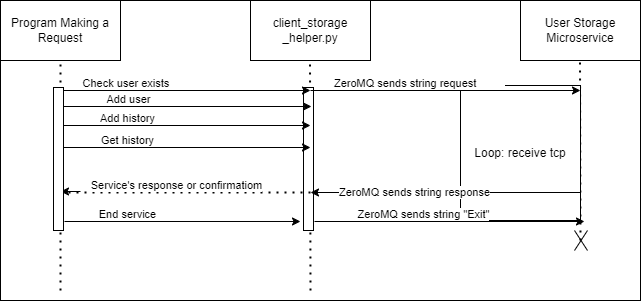

# Indexed User Storage Microservice

## Overview
This microservice provides user based history storage, so that each user may have a separate history.

## Requirements
* Python 3
* ZeroMQ library

## Running the microservice

1. Clone the repository to your machine:
    ```bash
    git clone https://github.com/blazakin/indexed_user_storage.git
    ```
2. Navigate to the microservice's directory:
    ```bash
    cd indexed_user_storage
    ```
3. Run main:
    ```bash
    python main.py
    ```

## Interfacing with the service
The service runs using ZeroMQ on tcp localhost port 5551 with a request-response communication pattern. 
If needed the port can be changed within main.py on line 25

If the interfacing program is using python, the file client_storage_helper.py can be used to help send requests.
Otherwise, it can manually be done by sending strings in the format "Option: _, User: _, History: _"
User and History can be whatever the client needs, however Option must be one of the following options:
* "Check User"
* "Add User"
* "Add History"
* "Get History"
* "Get History By Index"

From there, the service will return a string responding with an answer or the requested data.
For each of the options, these are the possible responses
* "Check User"
    * "User exists."
    * "User does not exist."
* "Add User"
    * "User successfully added."
* "Add History"
    * "History successfully added."
    * "User does not exist."
* "Get History"
    * All of user history as python list
    * "User does not exist."
* "Get History By Index"
    * The specific user history entry as a string
    * "User does not exist."
* Anything else
    * "Invalid Command"

### Interfacing with helper function
```
from client_storage_helper import *
storage_add_user("user1")
storage_add_history("user1", "Hello World!")
storage_get_history_by_index("user1", 0)
```

### Interfacing manually
```
import zmq


context = zmq.Context()
socket = context.socket(zmq.REQ)
socket.connect("tcp://localhost:5551")

socket.send_string("Option: Check User, User: user1, History: NA")

message = socket.recv()
message.decode()
print(message)
```

## UML Diagram
